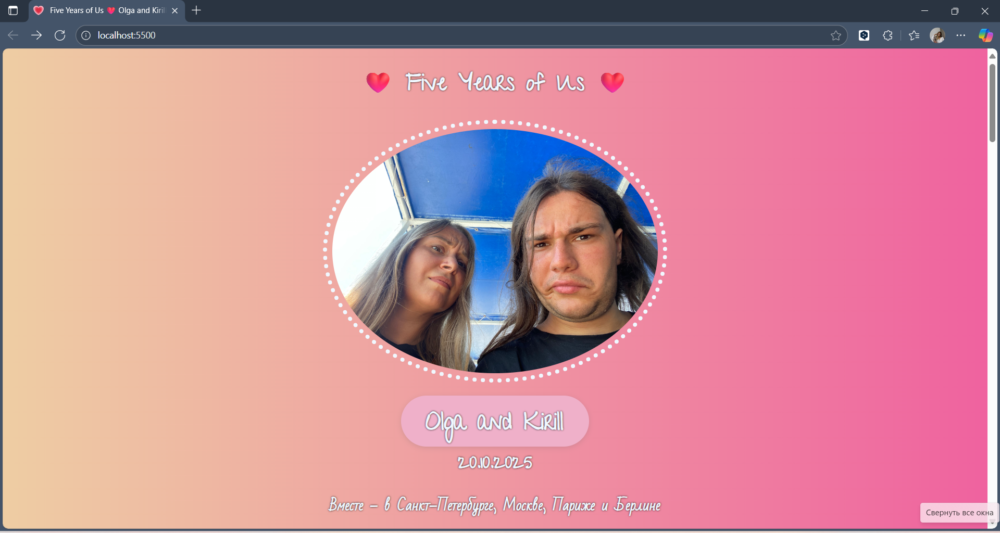
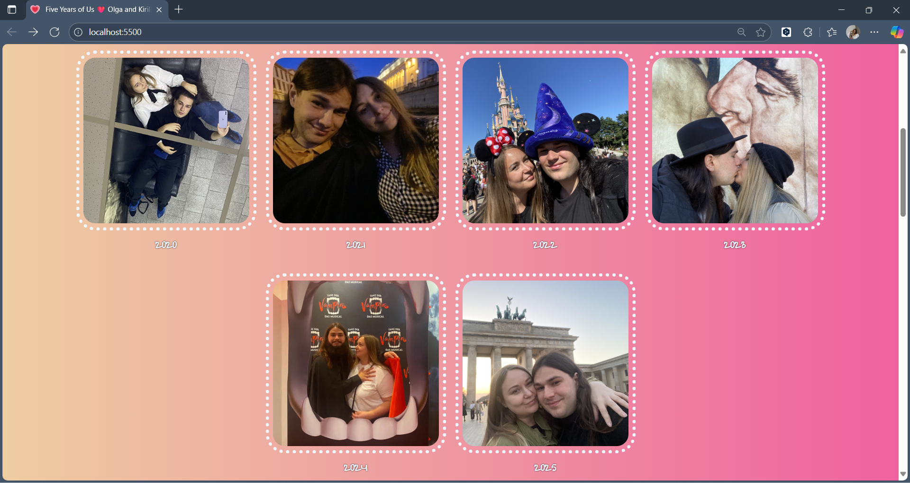
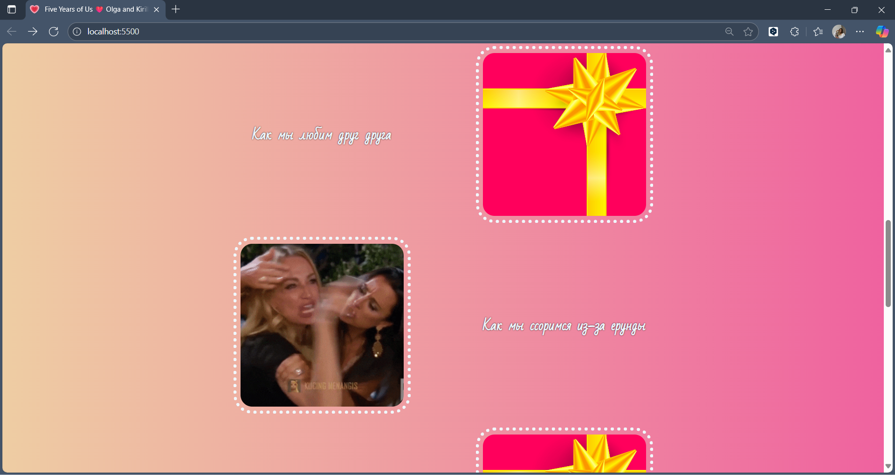

# Five Years Anniversary Website

A personalized anniversary gift card website that I adapted as my second web development project while learning on Scrimba.

**Live Demo:** [anniversary-giftcard.netlify.app](https://anniversary-giftcard.netlify.app/)

**Note:** This project is designed with a **Desktop First** approach, prioritizing the desktop experience before adapting it for mobile devices.

## 🎯 Project Overview

This project started as a Scrimba assignment but evolved into something much more as I challenged myself to implement the exact design I had envisioned. It became an exciting learning journey into the intricacies of CSS layouts, responsive design, and cross-device compatibility.

## 🚀 Features Implemented

- **Responsive photo grid** that adapts to different screen sizes using `@media (max-width: 900px)`
- **CSS Grid layout** for precise control over gift section positioning
- **Multi-language typography** with different fonts optimized for Russian and English text
- **Touch-friendly interactions** - adapted hover effects to work on mobile devices using `:active` pseudo-class
- **Centered GIF backgrounds** - used `background-position-x` to fit wide-format GIFs into square containers
- **Visual spacing technique** - implemented `background-clip: content-box` to create visible padding between images and borders in gift section
- **Custom favicon** - added a unique favicon to enhance user experience in the browser tab

## 🎨 Design Insights

The biggest takeaway from this project was understanding **the critical role of web designers** in creating beautiful, modern websites. Selecting appropriate fonts, colors, spacing, and visual hierarchy requires both technical knowledge and aesthetic sensibility. While I focused primarily on learning HTML/CSS fundamentals, I gained deep appreciation for the design process.

## 🐛 Known Issues

After deployment to Netlify, I discovered some issues that became learning opportunities for future projects:
- **Font blur on mobile devices** - Text rendering issues due to font smoothing
- **Small font size in gift sections on mobile screens** - needs responsive typography
- **Lack of pre-deployment mobile testing** - need to test on physical devices before going live

## 🛠️ Technologies Used

- HTML5
- CSS
- Custom fonts (Google Fonts)
- Netlify (deployment)

