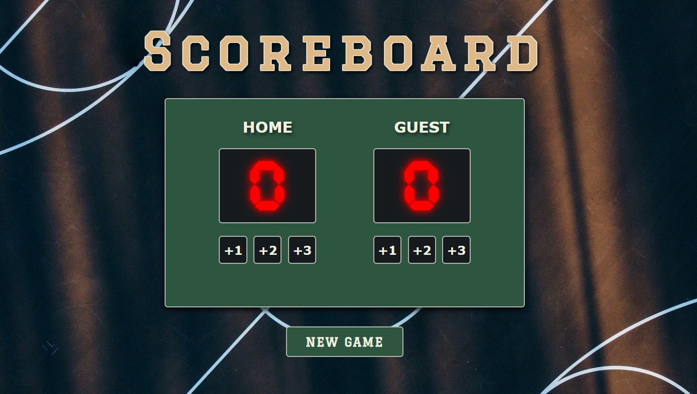

# Basketball Scoreboard

An interactive basketball scoreboard with score tracking and visual leader highlighting.

**Live Demo:** [basket-score-app.netlify.app](https://basket-score-app.netlify.app/)

  

## 🎯 Project Overview

My first project using JavaScript. During development, I learned to dynamically add and remove CSS classes based on specific conditions — for example, the `leader` class is automatically applied to the team with the higher score.

## 🛠️ Technologies Used

- **HTML5**
- **CSS3**
- **JavaScript**