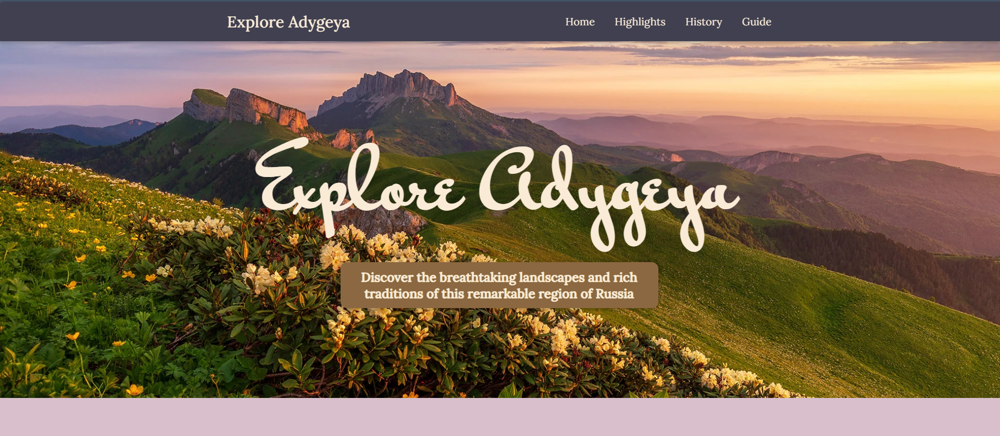
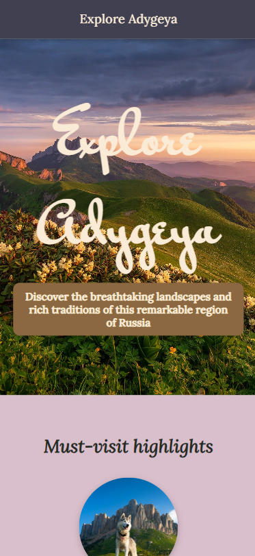
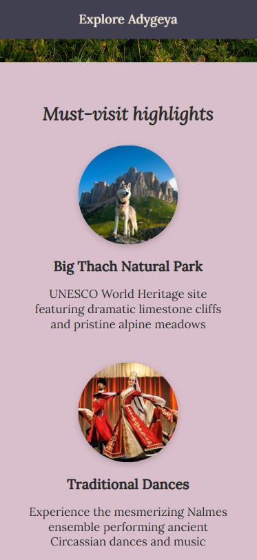

# Homeland Homepage

A tribute website to Adygeya, my homeland region in Russia. Built with pure HTML and CSS from a [Figma design](https://www.figma.com/design/2QuGfAOcHaZJ6aHXfuamnK/Hometown-Homepage?node-id=0-1&t=gQvTlyRZq1zIjLJD-1), expanding it with custom features to practice fundamental layout concepts.

**Live Demo:** [explore-adygeya.netlify.app](https://explore-adygeya.netlify.app/)

### Desktop View

### Mobile View

  
  
  

## ✨ Features

Going beyond the assignment requirements, I implemented:

- **Sticky navigation header** with smooth anchor link scrolling
- **Responsive design** optimized for mobile, tablet, and desktop screens
- **Flexbox layouts** with advanced techniques (`.reverse` class for alternating card layouts)
- **Google Fonts integration** (Mr Bedfort & Lora)
- **Footer** with copyright information

## 🛠️ Technologies Used

- HTML5
- CSS3
- Netlify (deployment)