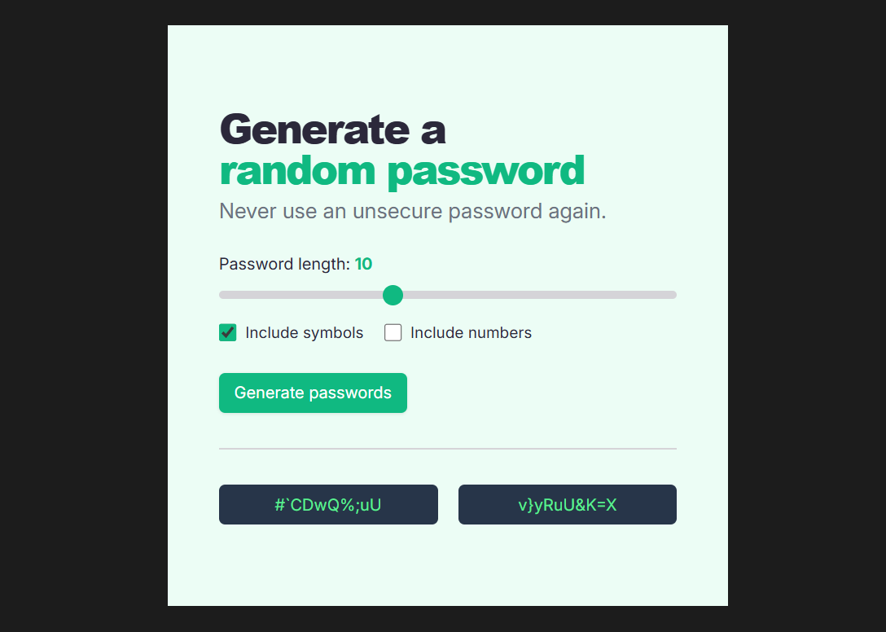
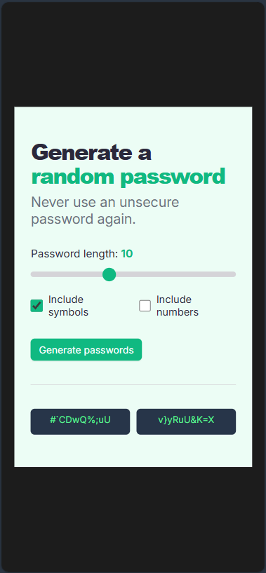

# Password Generator

A random password generator with customizable settings and one-click copy functionality.

**Live Demo:** [easy-pass-creator.netlify.app](https://easy-pass-creator.netlify.app/)

  
  

## 🎯 Project Overview

In this project, I focused on creating a pixel-perfect implementation matching the Figma design. Additionally, I completed all stretch goals: added a password length slider, implemented toggle checkboxes for symbols and numbers, and created a copy-on-click feature — all because I was curious to learn how these features work.

## 🛠️ Technologies Used

- **HTML5**
- **CSS3**
- **JavaScript**
