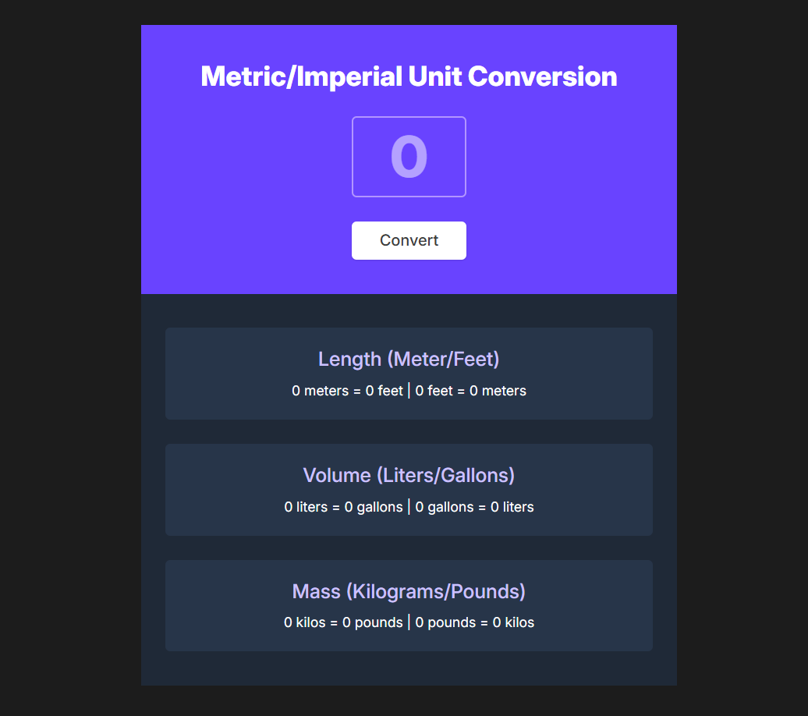
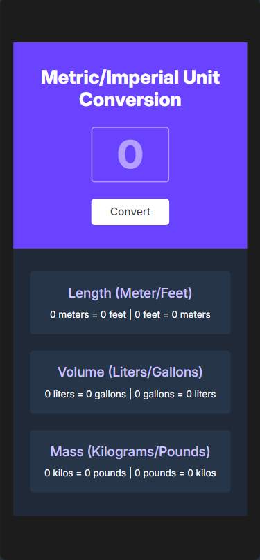

# Unit Converter

A metric/imperial unit converter for length, volume, and mass measurements.

**Live Demo:** [converter-units.netlify.app](https://converter-units.netlify.app/)

  
  

## 🎯 Project Overview

In this project, I built a unit converter that handles conversions between metric and imperial systems. I implemented input validation, form event handling, and used objects to store conversion ratios efficiently.

## 🛠️ Technologies Used

- **HTML5**
- **CSS3**
- **JavaScript**